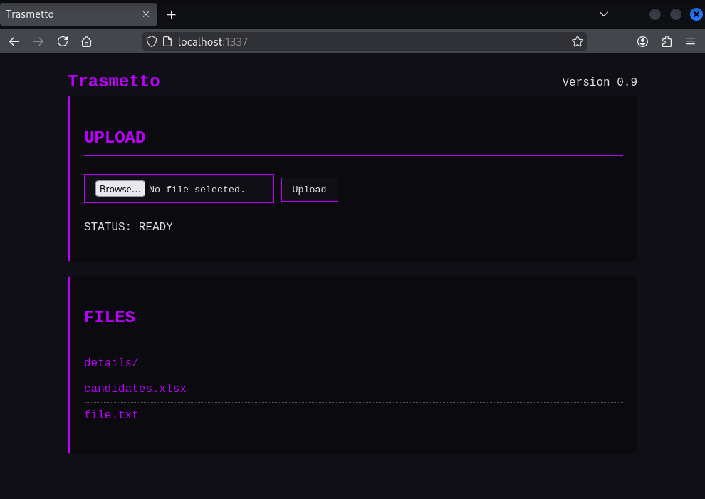

# Trasmetto
Trasmetto is a simple HTTP Server written in GO that allows file uploads and downloads.



### Usage:
```
trasmetto [-i IP] [-p PORT] [-d DIR]
```

### Available options
| Parameter  | Description | Default |
| -------- | ------- |------- |
| `-p` or `--port`  |  IP address to bind to  | 0.0.0.0 |
| `-i` or `--ip` | Port number to listen on | 8000 |
| `-d` or `--dir` | Directory to serve | `.` |

Precompiled binaries can be found on the *Releases* page.